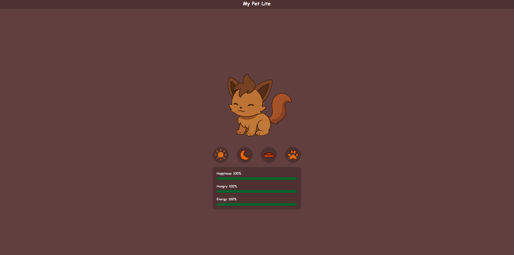
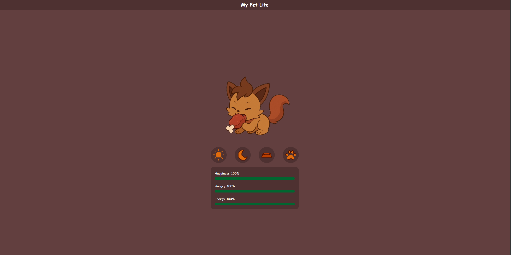
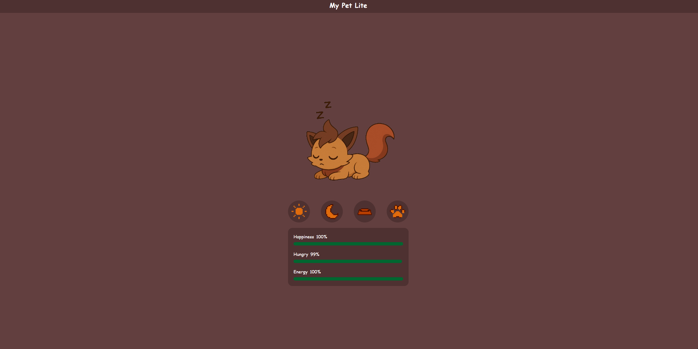
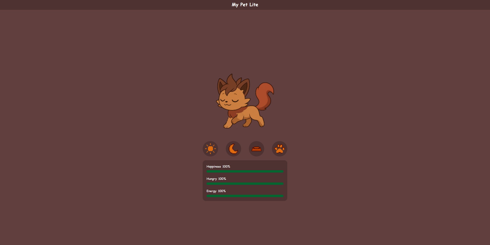

# Virtual Pet Simulator

A fun and engaging **virtual pet simulator** built with **React** and **TypeScript**. Raise, feed, play with, and care for your digital pet in a responsive, interactive web app.

---

## Table of Contents

- [Features](#features)  
- [Demo / Screenshots](#demo--screenshots)  
- [Tech Stack](#tech-stack)  
- [Getting Started](#getting-started)  
  - [Prerequisites](#prerequisites)  
  - [Installation](#installation)  
  - [Running Locally](#running-locally)  
  - [Building for Production](#building-for-production)
- [Deployment](#deployment)

---

## Features

- **Pet Lifecycle**: Your pet evolves or changes based on care (feeding, sleeping, playing)  
- **Stat Tracking**: Monitor key attributes such as hunger, mood, energy, health  
- **Interactions**: Feed the pet, walk with the pet, make it sleep or wake it
- **Responsive UI**: Works well on desktop and mobile  
- **Animations & Visual Feedback**: Visual cues and animations when interacting  

---

## Demo / Screenshots

### Idle  


### Feeding


### Sleeping


### Walking


---

## Tech Stack

- **Framework**: React  
- **Language**: TypeScript  
- **Build Tool**: Vite  
- **State Management**: React State
- **Styling**: Tailwind  
- **Storage / Persistence**: Local Storage / IndexedDB / Backend API (if any)  

---

## Getting Started

### Prerequisites

- Node.js (≥ 14.x recommended)  
- npm or Yarn  

### Installation

```bash
# Clone the repository
git clone https://github.com/zvoosh/virtual-pet-simulator.git

# Navigate to the project folder
cd virtual-pet-simulator

# Install dependencies
npm install
# or
yarn install
```

## Deployment
The project is hosted on Hostinger and can be viewed on domain: https://mypetlite.dusanprogram.eu

---
Built with ❤️ by zvoosh.